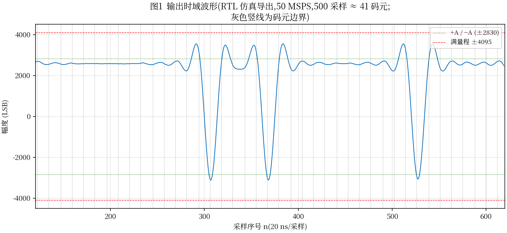
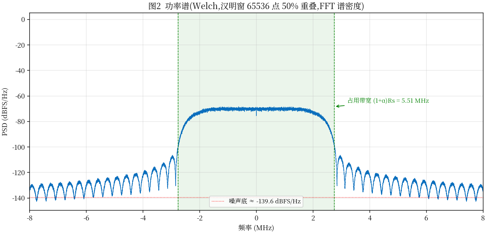
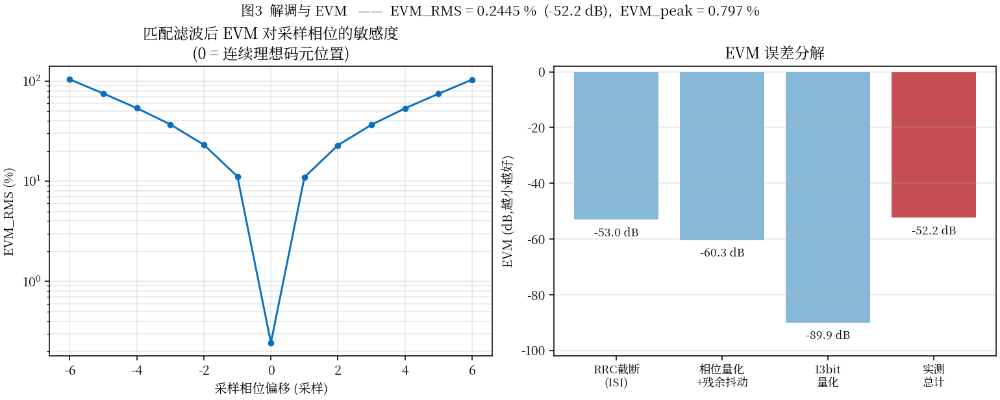
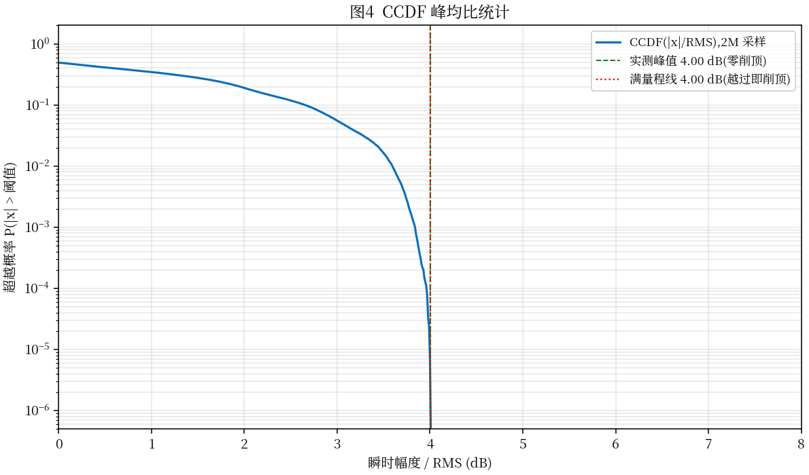
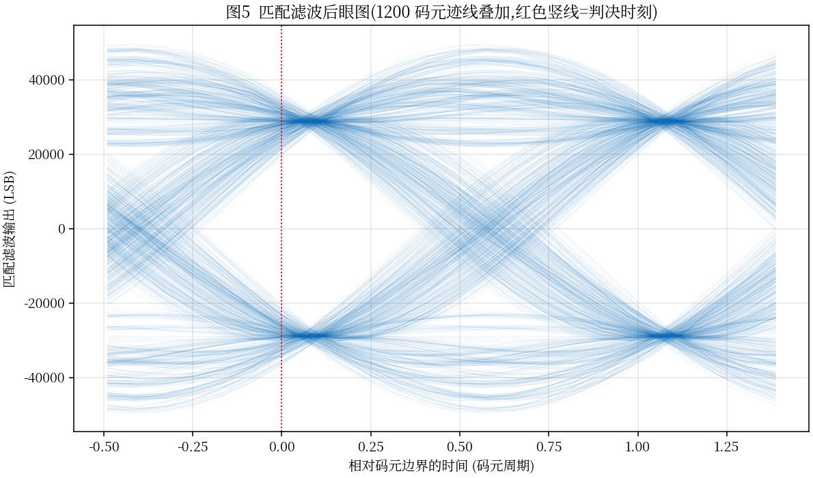

# BPSK 信号源波形质量报告

| | |
|---|---|
| 被测对象 | `rtl/bpsk_src_top.v`(PN23 + RRC α=0.35,**149 阶 Q1.14 + 51 相位分数延迟合成**,13-bit 输出,幅度 = 2830) |
| 数据来源 | **iverilog RTL 仿真实测导出**(`tb_bpsk_src.v +dump=`),2 000 000 采样 / 163 199 码元,导出同时通过 golden 逐位比对(PASS) |
| 分析工具 | `scripts/analyze_wave.py`(numpy / scipy / matplotlib) |
| 日期 / 版本 | 2026-09-12 / V1.1(V1.0 为 ±4 码元直接冲激架构;本版为分数延迟合成架构,见 §7) |

---

## 1 时域波形

500 个采样(≈41 个码元)的 RTL 输出。波形在 ±A(±2830,绿色点线)附近游走、码元过渡处过冲,最大值 4094 距满量程 ±4095(红色虚线)仅 1 LSB——幅度定标刻意锁定的零削顶工作点;灰色竖线为码元边界,边界处波形连续、无跳变毛刺。

## 2 频谱(FFT / Welch 功率谱)

| 指标 | 实测 | 理论 | 结论 |
|---|---|---|---|
| 占用带宽 (1+α)Rs | **5.508 MHz** | 5.508 MHz | 精确一致 |
| 主瓣 PSD 高度 | ≈ −71 dBFS/Hz | −71.1 dBFS/Hz | 一致 |
| 噪声底(12~25 MHz 中位) | **−139.6 dBFS/Hz** | — | 无杂散岛 |
| 带外功率(2.754~25 MHz)/ 带内功率 | **−27.6 dB** | — | 较上版(−23.6)改善 4 dB,来自跨度 ±4T→±6T |

谱形为标准 RRC 主瓣 + 截断旁瓣,平滑滚降、无谱线、无杂散。

## 3 解调与 EVM

方法:接收端用理想浮点 RRC 匹配滤波,在连续理想码元位置 t = n + f 处三次插值取样(由 NCO 关系精确恢复),符号判决后与 PN23 参照序列求误差。

| 指标 | 本版(分数延迟合成) | 上版(±4T 直接冲激) |
|---|---|---|
| **EVM_RMS** | **0.2445%(−52.2 dB)** | 4.9236%(−26.2 dB) |
| EVM_peak | 0.797%(亦 <1%) | 13.3% |
| 定时敏感度 | 偏移 ±1 采样 → EVM 恶化 ~4 倍(≈1%),判决时刻须压在理想码元位置 | 同左 |

**误差分解**(符号级直接作差;合成校验 0.2442% vs 实测 0.2445%,闭合):

| 误差源 | EVM | 折合 dB |
|---|---|---|
| RRC ±6 码元截断(ISI) | 2.24e-3 | −53.0 dB(主导) |
| 51 相位量化 + 残余定时抖动 | 9.63e-4 | −60.3 dB |
| 13-bit 输出量化 + 取整 | 3.19e-5 | −89.9 dB |

两处定点量化(−60 / −90 dB)均可忽略;EVM 由 ±6 码元截断主导,若需进一步压低,可试探 ±8T(193 阶,实测无抖动截断 −50.3 dB)——但对绝大多数应用,当前指标已有充分裕量。

## 4 CCDF 峰均比统计

- RMS = 2582.86 LSB;实测峰值 4094 → **峰均比 4.00 dB**
- 满量程线 4.00 dB:**曲线恰好终止于满量程线,全程零削顶**(幅度 2830 经完整 PN23 周期 102 801 655 采样复核,saturated = 0)

## 5 眼图

匹配滤波后 1200 码元迹线叠加:交叉点汇聚干净,判决时刻(红色竖线)眼图完全张开。

## 6 结论

| 项目 | 结果 | 判定 |
|---|---|---|
| 码元速率 | 4.08 MHz(FTW 定时,163 200 节拍/2M 采样精确吻合) | ✅ |
| 占用带宽 | 5.508 MHz = (1+α)Rs | ✅ |
| **EVM_RMS** | **0.2445%(−52.2 dB),达到 <1% 目标且余量 4 倍** | ✅ |
| 零削顶 | 峰值 4094 < 4095,完整 PN23 周期复核零削顶 | ✅ |
| 频谱纯度 | 噪声底 −139.6 dBFS/Hz,无杂散;带外 −27.6 dB | ✅ |
| 可解调性 | 匹配滤波 + 理想码元位置取样即恢复 PN23,眼图全开 | ✅ |

## 7 版本说明(V1.0 → V1.1 架构改进)

V1.0(±4 码元直接冲激)实测 EVM 4.92%(−26.2 dB)。经误差溯源发现主导项并非抽头截断,而是**码元定时栅格量化**:每码元 12.2549 采样,冲激只能落在 20 ns 整数栅格上,±0.5 采样的定时抖动贡献了 ≈4.65%(−26.7 dB)的 EVM 地板——加长抽头(实测 ±12T 仍 −26.7 dB)或加窗均无法突破。

V1.1 改为**分数延迟相位合成**:利用理想码元位置 t_m = m×625/51 的分数部分以 51 码元为周期遍历 {0,1/51,…,50/51} 的性质,预存 51 套分数延迟 RRC 系数(±6 码元 149 阶,Q1.14),发端按 NCO 相位余量查表注入,把码元位置精确到 1/51 采样。滤波器核仍为零乘法器(查表 + 条件加减)。幅度默认值相应由 2797 调整为 2830(新波形峰值比变化,零削顶复核通过)。
